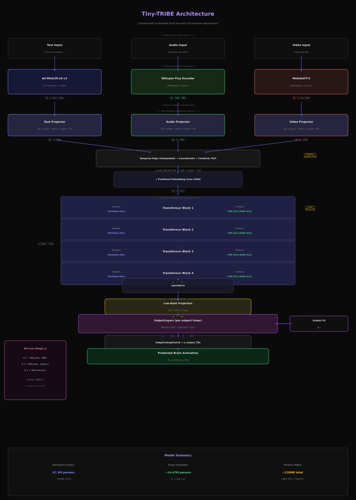
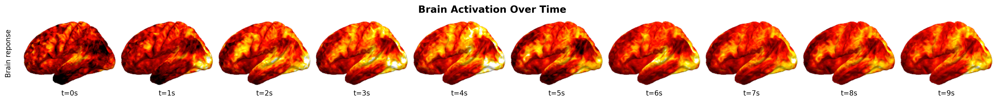
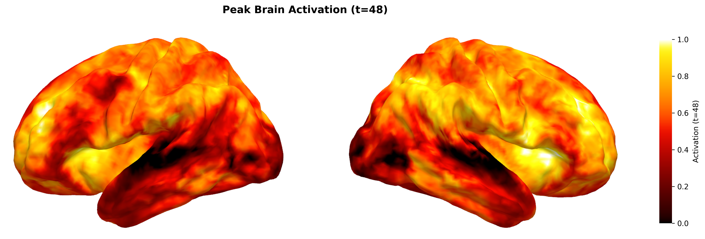
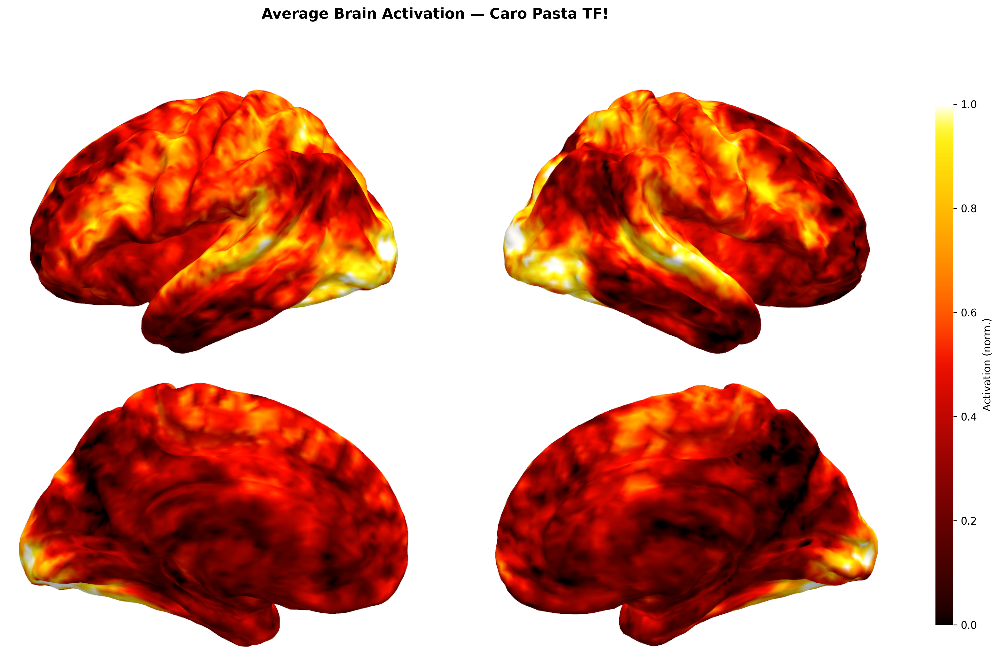
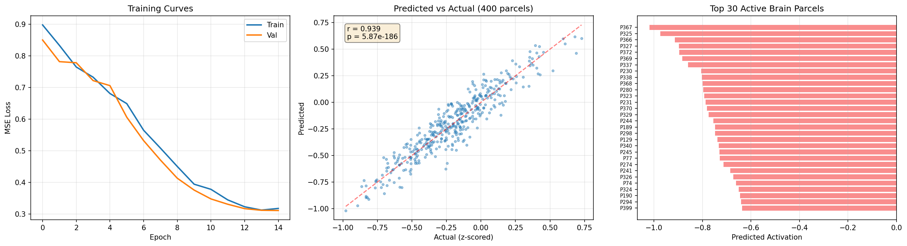

# 🧠 Tiny-TRIBE v3

<div align="center">
  
  <br>
  <em>Architecture Diagram generated by Nanobanana</em>
</div>

<p align="center">
  <strong>A lightweight, distilled brain encoding model predicting fMRI responses to naturalistic video stimuli.</strong>
</p>

Tiny-TRIBE is trained via knowledge distillation from [TRIBE v2](https://github.com/facebookresearch/tribev2), leveraging compact multimodal encoders (~14M trainable parameters) to map audio, visual, and textual features directly to cortical surface predictions (~20k vertices, fsaverage5).

## 📊 V3 Results & Visualizations

Our v3 model achieves highly competitive prediction accuracy while maintaining a radically smaller parameter footprint compared to the teacher model. 

### Brain Activation Mapping
The predicted cortical responses highlight specialized processing regions:
<div align="center">
  
</div>
<br>
<div align="center">
  
  
</div>

### Training Performance
<div align="center">
  
</div>

## 🏗️ Architecture Details

Tiny-TRIBE v3 uses three frozen backbone encoders:
- **Text**: `all-MiniLM-L6-v2` (22.7M)
- **Audio**: `Whisper-Tiny` encoder (39M)
- **Video**: `MobileViT-S` (5.6M)

These feed into a lightweight fusion Transformer that maps multimodal representations to the brain.

## 🚀 Quick Start

```bash
pip install -r requirements.txt
```

**Run Inference:**
```bash
python scripts/run_inference.py
```

**Build Distillation Dataset:**
```bash
python scripts/build_distillation_dataset.py
```

## 📦 Checkpoints & Data

The best checkpoint (epoch 52, Pearson r = 0.7278) is hosted on Hugging Face:

> **[`OnePunchMonk101010/tribev2-distilled`](https://huggingface.co/OnePunchMonk101010/tribev2-distilled)**
> `checkpoints/best-epoch=052-val/pearson_r=0.7278.ckpt`

```python
from huggingface_hub import hf_hub_download
path = hf_hub_download(
    repo_id="OnePunchMonk101010/tribev2-distilled",
    filename="checkpoints/best-epoch=052-val/pearson_r=0.7278.ckpt"
)
```

*(Note: `distillation_dataset.zip` and pre-extracted `features.zip` are hosted externally).*

## 📂 Project Structure

```text
tiny_tribe/          # Core package (backbones, model, training)
assets/              # Architecture diagrams, training results, and visualizations
data/                # Dataset features and metadata
things-to-read/      # Research papers, strategy documents, and training plans
models/              # Local model checkpoints and fusion models
notebooks/           # Jupyter notebooks for inference and analysis
scripts/             # Utility scripts (inference, dataset building, visualization)
artifact-scripts/    # Experimental, legacy, and artifact scripts
```

## 📚 Documentation & Strategy

- [STRATEGY_C_DEEP_DIVE.md](things-to-read/STRATEGY_C_DEEP_DIVE.md) — Full architecture and training strategy
- [TRIBE_V3_STRATEGY.md](things-to-read/TRIBE_V3_STRATEGY.md) — v3 design decisions
- [DISTILLATION_PATTERNS.md](things-to-read/DISTILLATION_PATTERNS.md) — KD training patterns
- [TINY_TRIBE_ARCHITECTURE.md](things-to-read/TINY_TRIBE_ARCHITECTURE.md) / [TINY_TRIBE_V3_ARCHITECTURE.md](things-to-read/TINY_TRIBE_V3_ARCHITECTURE.md) — Architecture diagrams

## 📝 Citations & Acknowledgments

If you use Tiny-TRIBE in your research, please consider citing the original TRIBE v2 paper as well as the underlying dataset tools:

```bibtex
@article{tribev2,
  title={TRIBE v2: A robust brain encoding model for naturalistic video stimuli},
  author={Facebook Research},
  year={2026},
  journal={arXiv preprint}
}

@article{abraham2014machine,
  title={Machine learning for neuroimaging with scikit-learn},
  author={Abraham, Alexandre and Pedregosa, Fabian and Eickenberg, Michael and Gervais, Philippe and Mueller, Andreas and Kossaifi, Jean and Gramfort, Alexandre and Thirion, Bertrand and Varoquaux, Ga{\"e}l},
  journal={Frontiers in neuroinformatics},
  volume={8},
  pages={14},
  year={2014},
  publisher={Frontiers Media SA}
}
```

*Data processed and visualized using [Nilearn](https://nilearn.github.io/) on the fsaverage5 surface mesh.*

---
<div align="center">
  Made with ❤️ by the Tiny-TRIBE Research Team.
</div>