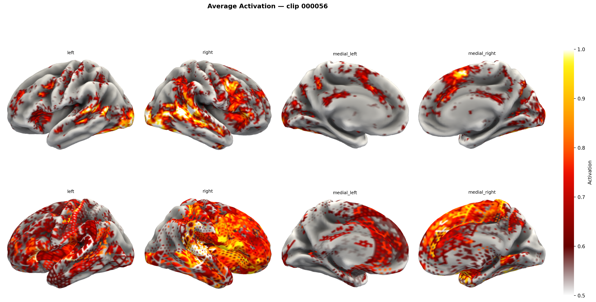
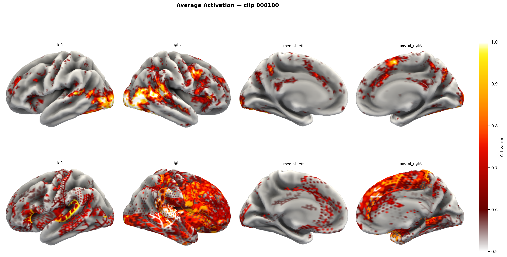
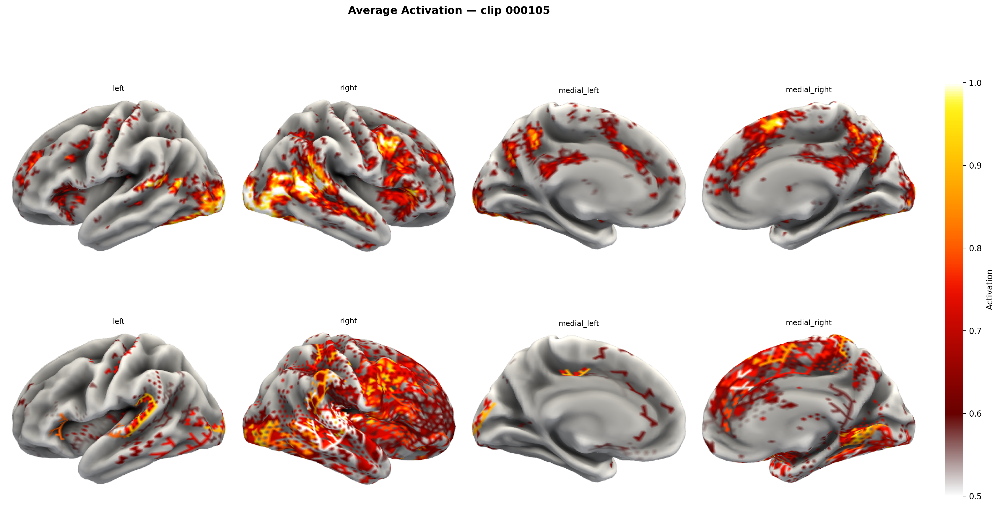
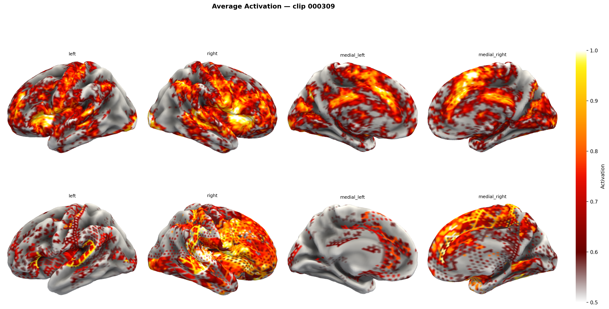
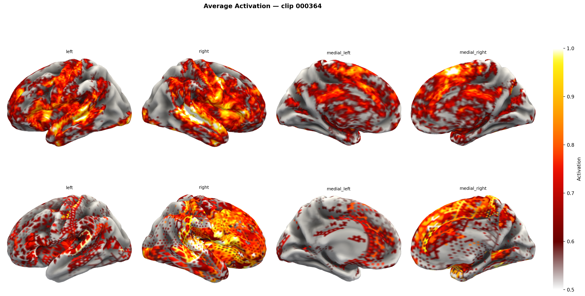
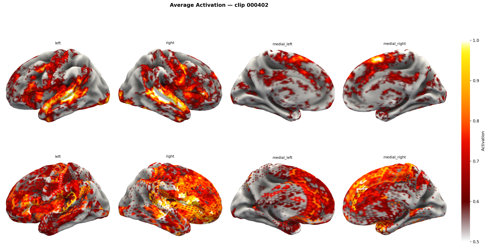

# 🧠 Tiny-TRIBE v3

<div align="center">
  
</div>

<p align="center">
  <strong>A lightweight, distilled brain encoding model predicting fMRI responses to naturalistic video stimuli.</strong>
</p>

Tiny-TRIBE is trained via knowledge distillation from [TRIBE v2](https://github.com/facebookresearch/tribev2), leveraging compact multimodal encoders (~14M trainable parameters) to map audio, visual, and textual features directly to cortical surface predictions (~20k vertices, fsaverage5).

## 📊 V3 Results & Visualizations

Our v3 model achieves highly competitive prediction accuracy while maintaining a radically smaller parameter footprint compared to the teacher model. 

### Distillation Performance
The following table summarizes the distillation progress and final alignment with the teacher model (TRIBE v2).

| Metric | POC Value (200 clips) |
|:---|:---|
| **Best Pearson r** | **0.7278** |
| **Convergence Epoch** | 520 |
| **Initial Alignment** | 0.0328 (Epoch 0) |
| **Mid-point Alignment** | 0.6158 (Epoch 250) |
| **Final Alignment** | 0.7278 (Epoch 520) |

> *Note: Pearson r measures the mean per-parcel correlation between student predictions and teacher targets across the 40-clip validation set.*

### Teacher vs. Student Comparison
The following table showcases the mean activation patterns (greyish schema) comparing the TRIBE v2 teacher model with our distilled Tiny-TRIBE v3 student.

| S.No | Brain Activation (Teacher vs. Student) |
|:---:|:---:|
| 1 |  |
| 2 |  |
| 3 |  |
| 4 |  |
| 5 |  |
| 6 |  |

### Training Performance
<div align="center">
  
</div>

## 🏗️ Architecture Details

Tiny-TRIBE v3 uses three frozen backbone encoders:
- **Text**: `all-MiniLM-L6-v2` (22.7M)
- **Audio**: `Whisper-Tiny` encoder (39M)
- **Video**: `MobileViT-S` (5.6M)

These feed into a lightweight fusion Transformer that maps multimodal representations to the brain.

## 🚀 Quick Start

```bash
pip install -r requirements.txt
```

**Run Inference:**
```bash
python scripts/run_inference.py
```

**Build Distillation Dataset:**
```bash
python scripts/build_distillation_dataset.py
```

## 📦 Checkpoints & Data

The best checkpoint (epoch 52, Pearson r = 0.7278) is hosted on Hugging Face:

> **[`OnePunchMonk101010/tribev2-distilled`](https://huggingface.co/OnePunchMonk101010/tribev2-distilled)**
> `checkpoints/best-epoch=052-val/pearson_r=0.7278.ckpt`

```python
from huggingface_hub import hf_hub_download
path = hf_hub_download(repo_id="OnePunchMonk101010/tribev2-distilled", filename="checkpoints/best-epoch=052-val/pearson_r=0.7278.ckpt")
```

### Dataset Note
The input-output pairs were generated by randomly sampling **200 videos** from the **[CINE Brain Dataset](https://github.com/onepunchmonk/cine-brain)** and inferring their fMRI responses using the **TRIBE v2** teacher model. Out of these 200 clips, **160 were used for training** and **40 were reserved for the test set**.

## 📂 Project Structure

```text
tiny_tribe/          # Core package (backbones, model, training)
assets/              # Architecture diagrams, training results, and visualizations
data/                # Dataset features and metadata
things-to-read/      # Research papers, strategy documents, and training plans
models/              # Local model checkpoints and fusion models
notebooks/           # Jupyter notebooks for inference and analysis
scripts/             # Utility scripts (inference, dataset building, visualization)
artifact-scripts/    # Experimental, legacy, and artifact scripts
```

## 📚 Documentation & Strategy

- [STRATEGY_C_DEEP_DIVE.md](things-to-read/STRATEGY_C_DEEP_DIVE.md) — Full architecture and training strategy
- [TRIBE_V3_STRATEGY.md](things-to-read/TRIBE_V3_STRATEGY.md) — v3 design decisions
- [DISTILLATION_PATTERNS.md](things-to-read/DISTILLATION_PATTERNS.md) — KD training patterns
- [TINY_TRIBE_ARCHITECTURE.md](things-to-read/TINY_TRIBE_ARCHITECTURE.md) / [TINY_TRIBE_V3_ARCHITECTURE.md](things-to-read/TINY_TRIBE_V3_ARCHITECTURE.md) — Architecture diagrams

## 📝 Citations & Acknowledgments

```bibtex
@article{tribev2,
  title={TRIBE v2: A robust brain encoding model for naturalistic video stimuli},
  author={Facebook Research},
  year={2026},
  journal={arXiv preprint}
}

@article{cinebrain,
  title={CINE Brain Dataset: A Multimodal Naturalistic Video Dataset for Brain Encoding},
  author={onepunchmonk},
  year={2026},
  url={https://github.com/onepunchmonk/cine-brain}
}

@article{abraham2014machine,
  title={Machine learning for neuroimaging with scikit-learn},
  author={Abraham, Alexandre and others},
  journal={Frontiers in neuroinformatics},
  year={2014}
}
```

*Data processed and visualized using [Nilearn](https://nilearn.github.io/) on the fsaverage5 surface mesh.*

---
<div align="center">
  Made with ❤️ by <a href="https://github.com/OnePunchMonk">onepunchmonk</a>
</div>
