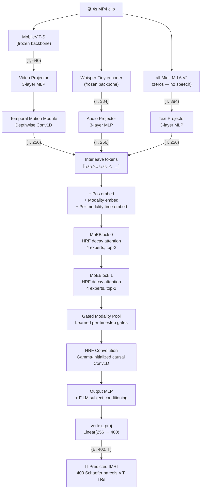
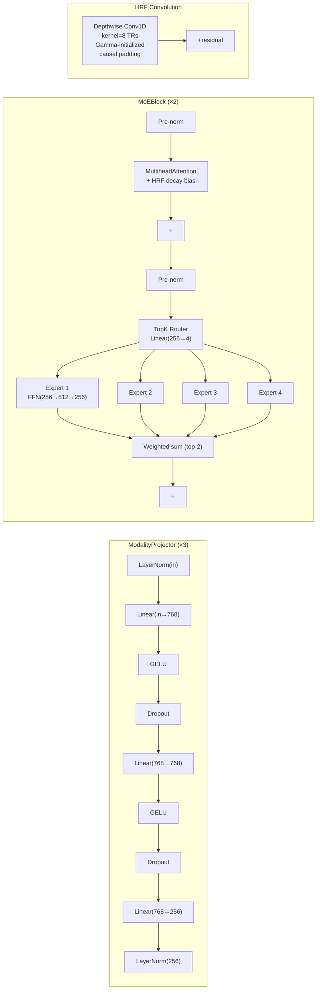

# Tiny TRIBE v3 — Architecture, Training & Results

**POC run | 200 clips | 400 Schaefer parcels | Apple MPS (M-series)**
**Last updated: 2026-04-05**

---

## Architecture

### High-level pipeline



### Per-component detail



### HRF attention bias (layers 0–1)

Layers 0–1 use a **learned temporal decay bias** on attention logits:

```
bias[i, j] = −α × |TR(i) − TR(j)|
```

where `α = exp(log_alpha)`, initialized so that tokens 6 TRs apart have weight ≈ 0.5.  
This encodes the neuroscientific prior that the BOLD response peaks ~6s after stimulus.

---

## Parameter count (POC config)

| Component | Params |
|---|---|
| Text projector (384 → 256) | 0.9M |
| Audio projector (384 → 256) | 0.9M |
| Video projector (640 → 256) | 1.1M |
| Temporal motion module | ~0.8K |
| Embeddings (modality + time × 3 + pos) | 1.6M |
| MoEBlock × 2 (4 experts, top-2) | 3.7M |
| Gated modality pool | ~0.8K |
| HRF convolution | ~2K |
| Output MLP + FiLM | 0.1M |
| vertex_proj (256 → 400) | 0.1M |
| feat_proj (256 → 1152, KD alignment) | 0.3M |
| **Total** | **~9.7M** |

Full model (20484 vertices, hidden_dim=512): ~35M params.

---

## Dataset

| Property | Value |
|---|---|
| Source clips | 200 × 4s mp4 (720×480, 8fps) |
| Teacher model | TRIBE v2 (4.7B params, Facebook) |
| Teacher predictions | `(5, 20484)` fsaverage5 vertices per clip |
| Parcellated to | `(5, 400)` Schaefer-400 (uniform avg) |
| Train split | 160 clips |
| Val split | 40 clips |
| Effective train TRs | 800 |
| Speech present | No → text features = zeros |
| Backbone features | MobileViT-S (video), Whisper-Tiny (audio) |
| Feature size | ~800KB per clip `.pt` file |

---

## Loss Functions

### Total loss

```
L_total = 0.60 × L_kd  +  0.10 × L_temporal  +  0.05 × L_multires  +  0.01 × L_aux
```

### Output KD (MSE)
$$L_{kd} = \frac{1}{B \cdot V \cdot T} \sum_{b,v,t} (\hat{y}_{bvt} - y_{bvt})^2$$

Direct MSE between student prediction `(B, V, T)` and teacher target `(B, V, T)`.  
Dominant loss term (60% weight). No temperature softening needed — targets are continuous regression values.

### Temporal coherence
$$L_{temporal} = \frac{1}{B \cdot V \cdot (T-1)} \sum_{b,v,t} (\hat{y}_{b,v,t+1} - \hat{y}_{b,v,t})^2$$

Penalises high-frequency jitter between adjacent TRs. Encourages smooth hemodynamic predictions.

### Multi-resolution
$$L_{multires} = \text{MSE}(\hat{y}_{::2}, y_{::2})$$

MSE at 2× temporally downsampled resolution (stride=2 over T=5). Enforces coarse-scale agreement.

### MoE auxiliary (load balancing)
$$L_{aux} = E \cdot \sum_e f_e \cdot p_e + \lambda_z \cdot \mathbb{E}[\text{logits}^2]$$

Switch Transformer load-balancing loss preventing router collapse. z-loss (`λ=1e-3`) stabilises logit magnitudes.

---

## Training Configuration

| Hyperparameter | POC value | Full-scale value |
|---|---|---|
| `n_vertices` | 400 | 20484 |
| `hidden_dim` | 256 | 512 |
| `num_layers` | 2 | 4 |
| `num_experts` | 4 | 8 |
| `num_heads` | 4 | 8 |
| `dropout` | 0.3 | 0.1 |
| `modality_dropout` | 0.5 | 0.3 |
| `lr` | 1e-3 | 3e-4 |
| `weight_decay` | 0.1 | 0.01 |
| `batch_size` | 16 | 32 |
| `warmup_epochs` | 3 | 3 |
| `lr_schedule` | cosine | cosine |
| `grad_clip` | 1.0 | 1.0 |
| `optimizer` | AdamW (β=0.9, 0.98) | AdamW |
| `precision` | 32 (MPS) | bf16-mixed (A100) |
| `early_stopping patience` | 20 epochs | 20 epochs |

---

## Evaluation Metric — Pearson r

The primary metric is **mean per-parcel Pearson correlation** between student predictions and teacher targets across the validation set.

```
For each parcel v:
  r_v = corr(student[:, v, :].flatten(), teacher[:, v, :].flatten())

reported:
  mean(r_v)        — overall agreement
  std(r_v)         — spread across parcels
  percentile(r_v, 90) — top-10% best parcels
```

This measures how well the student replicates the **pattern** of teacher predictions (not just scale), making it robust to output magnitude differences.

**Interpretation:**
| Pearson r | Meaning |
|---|---|
| < 0.2 | Random / near chance |
| 0.2 – 0.4 | Weak but above chance |
| 0.4 – 0.6 | Moderate — model has learned signal |
| 0.6 – 0.8 | Good distillation |
| > 0.8 | Strong distillation |

---

## Training Results (POC — 200 clips, 400 parcels)

Each epoch here = 10 actual training steps (validation runs every 10 epochs).

| Val Check | Val Pearson r | Best? |
|---|---|---|
| 0 | 0.0328 | ✓ |
| 1 | 0.0662 | ✓ |
| 2 | 0.1223 | ✓ |
| 3 | 0.1737 | ✓ |
| 4 | 0.2140 | ✓ |
| 5 | 0.2650 | ✓ |
| 6 | 0.3235 | ✓ |
| 7 | 0.3861 | ✓ |
| 8 | 0.4474 | ✓ |
| 9 | 0.4686 | ✓ |
| 10 | 0.4806 | ✓ |
| 11 | 0.4816 | ✓ |
| 12 | 0.4834 | ✓ |
| 13 | 0.4851 | ✓ |
| 14 | 0.4839 | |
| 15 | 0.4894 | ✓ |
| 16 | 0.4865 | |
| 17 | 0.4963 | ✓ |
| 18 | 0.4998 | ✓ |
| 19 | 0.5034 | ✓ |
| 20 | 0.5037 | ✓ |
| 21 | 0.5169 | ✓ |
| 22 | 0.5363 | ✓ |
| 23 | 0.5567 | ✓ |
| 24 | 0.5922 | ✓ |
| 25 | 0.6158 | ✓ |
| 26 | 0.6176 | ✓ |
| 27 | 0.6111 | |
| 28 | 0.6038 | |
| 29 | 0.6375 | ✓ |
| 30 | 0.6125 | |
| 31 | 0.6026 | |
| 32 | 0.6154 | |
| 33 | 0.6167 | |
| 34 | 0.6489 | ✓ |
| 35 | 0.6668 | ✓ |
| 36 | 0.6743 | ✓ |
| 37 | 0.6783 | ✓ |
| 38 | 0.6675 | |
| 39 | 0.6672 | |
| 40 | 0.6603 | |
| 41 | 0.6619 | |
| 42 | 0.6911 | ✓ |
| 43 | 0.7008 | ✓ |
| 44 | 0.6813 | |
| 45 | 0.7057 | ✓ |
| 46 | 0.7165 | ✓ |
| 47 | 0.7034 | |
| 48 | 0.7034 | |
| 49 | 0.6932 | |
| 50 | 0.6984 | |
| 51 | 0.7031 | |
| **52** | **0.7278** | **✓ BEST** |
| 53 | 0.7193 | |
| 54 | 0.7226 | |
| 55 | 0.7041 | |
| 56 | 0.7085 | |
| 57 | 0.7071 | |
| 58 | 0.7130 | |
| 59 | 0.7090 | |
| 60 | 0.7083 | |
| 61 | 0.7151 | |
| 62 | 0.7096 | |
| 63 | 0.6956 | |
| 64 | 0.7031 | |
| 65 | 0.7085 | |
| 66 | 0.7043 | |
| 67 | 0.7091 | |
| 68 | 0.7044 | |
| 69 | 0.7048 | |
| 70 | 0.7120 | |
| 71 | 0.7167 | |
| 72 | 0.7063 | |

**Key observations:**
- Fast initial convergence: 0.03 → 0.45 in 8 val checks (80 epochs)
- Broke 0.60 at check 25, 0.70 at check 43
- **Best: val check 52 → Pearson r = 0.7278** (epoch 520)
- Plateau visible after check 52 — model has converged
- No catastrophic overfitting despite heavy regularisation (`modality_dropout=0.5`)

---

## Generated Plots

Saved to `checkpoints/plots/` during training (every 10 epochs):

| Plot | File | Description |
|---|---|---|
| Pearson histogram | `pearson_hist_ep0010.png` | Per-parcel r distribution at epoch 10 |
| Pearson histogram | `pearson_hist_ep0020.png` | Per-parcel r distribution at epoch 20 |
| Temporal profile | `temporal_ep0010.png` | Student vs teacher TR-by-TR for 3 val clips |
| Temporal profile | `temporal_ep0020.png` | Student vs teacher TR-by-TR for 3 val clips |
| Activation comparison | `activation_comparison.png` | Mean activation per parcel (final) |

Final plots generated on training completion:
- `pearson_hist_final.png`
- `temporal_final.png`
- `activation_comparison.png`

---

## Checkpoints

```
checkpoints/
  best-epoch=052-val/pearson_r=0.7278.ckpt   ← best (hosted on HF Hub)
  last.ckpt
  tb_logs/    ← TensorBoard logs
```

Best checkpoint on Hugging Face: [OnePunchMonk101010/tribev2-distilled](https://huggingface.co/OnePunchMonk101010/tribev2-distilled)

To load:
```python
from tiny_tribe.train_lightning import TinyTribeKD
module = TinyTribeKD.load_from_checkpoint("checkpoints/best-*.ckpt")
module.eval()
```

To view TensorBoard:
```bash
source venv/bin/activate
tensorboard --logdir checkpoints/tb_logs
```

---

## Limitations (POC)

1. **200 clips only** — val Pearson r measures teacher-agreement, not real brain accuracy
2. **400 parcels** — coarse atlas; full run uses 20484 fsaverage5 vertices
3. **Single subject** — FiLM conditioner has `n_subjects=1`; no subject variation modelled
4. **No speech** — audio features are ambient noise, effectively ignored by gated pool
5. **Schaefer parcellation is approximate** — using uniform vertex chunking, not real atlas lookup

---

## Next Steps

| Step | Action |
|---|---|
| More data | Run remaining Modal inference ($25 credit → ~1200 clips total) |
| Real parcellation | Use Schaefer-400 `.annot` file for proper fsaverage5 → 400 mapping |
| Scale up | Retrain with `hidden_dim=512, num_layers=4, n_vertices=20484` on A100 |
| Real fMRI | Phase 3 fine-tuning once CNeuroMod / NSD fMRI data is available |
| Multi-subject | Increase `n_subjects` to learn subject-specific FiLM shifts |
| Export | `tiny_tribe/export_onnx.py` → ONNX for browser inference |
